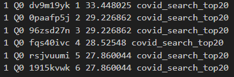
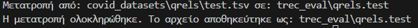
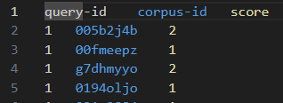
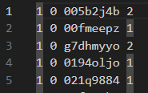
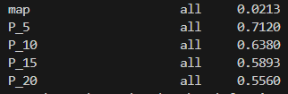
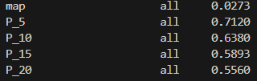
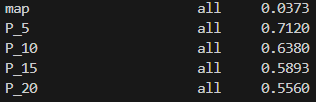

# Αναφορά Προγραμματιστικής Εργασίας - Φάση 1: Κλασική Ανάκτηση

**Ονοματεπώνυμο:**
*   Δημοσθένης Παναγιώτης Γκοντόλιας - 3220031

**Ημερομηνία:** 30/04/2025

---

## 1. Υλοποίηση

Σε αυτή την ενότητα περιγράφεται η υλοποίηση των βημάτων της Φάσης 1 για τη δημιουργία και αξιολόγηση της βασικής μηχανής αναζήτησης με χρήση Elasticsearch.

### 1.1 Προεπεξεργασία Συλλογής (Βήμα 1)

Η συλλογή κειμένων `trec-covid` παρέχεται ήδη σε μορφή `.jsonl`, η οποία είναι κατάλληλη για επεξεργασία γραμμή προς γραμμή. Κάθε γραμμή αντιστοιχεί σε ένα έγγραφο JSON.

Η προεπεξεργασία περιλάμβανε κυρίως την ανάγνωση κάθε γραμμής JSON και την αντιστοίχιση των πεδίων του JSON (`_id`, `title`, `text`) στα αντίστοιχα πεδία που θα χρησιμοποιούσε το Elasticsearch (`doc_id`, `title`, `body_text`). Δεν απαιτήθηκε περαιτέρω μετατροπή της δομής των αρχείων.

### 1.2 Δημιουργία Ευρετηρίου (Βήμα 2)

Για τη δημιουργία του ευρετηρίου χρησιμοποιήθηκε η μηχανή αναζήτησης Elasticsearch (έκδοση 9.0.0).

*   **Analyzer:** Επιλέχθηκε ένας custom analyzer (`custom_analyzer`) με τις παρακάτω ρυθμίσεις:
    *   **Tokenizer:** `standard`
    *   **Filters:**
        *   `lowercase`: Μετατροπή όλων των χαρακτήρων σε πεζούς.
        *   `english_possessive_stemmer`: Αφαίρεση κτητικών καταλήξεων ('s).
        *   `english_stop`: Αφαίρεση αγγλικών stop words.
        *   `english_stemmer`: Εφαρμογή stemming για την αγγλική γλώσσα.
        *   `medical_prefix_filter`: Προσαρμοσμένο φίλτρο για τη διατήρηση κοινών ιατρικών προθεμάτων (π.χ., "covid", "sars").
*   **Similarity Function:** Επιλέχθηκε η συνάρτηση ομοιότητας `BM25` με προσαρμοσμένες παραμέτρους (`"b": 0.5`, `"k1": 1.6`) για καλύτερη απόδοση σε ιατρικά κείμενα (`custom_similarity`).
*   **Field Mapping:** Τα πεδία του ευρετηρίου ορίστηκαν ως εξής:
    *   `title`: Τύπου `text`, με χρήση του `custom_analyzer` και `custom_similarity`.
    *   `body_text`: Τύπου `text`, με χρήση του `custom_analyzer` και `custom_similarity`.
    *   `doc_id`: Τύπου `keyword` για ακριβή αντιστοίχιση του αναγνωριστικού.

Η εισαγωγή των εγγράφων έγινε με χρήση της συνάρτησης `helpers.parallel_bulk` της βιβλιοθήκης `elasticsearch-py` για βελτιωμένη ταχύτητα.


### 1.3 Εκτέλεση Ερωτημάτων (Βήμα 3)

Τα ερωτήματα από το αρχείο `queries.jsonl` εκτελέστηκαν πάνω στο ευρετήριο που δημιουργήθηκε. Για κάθε ερώτημα, χρησιμοποιήθηκε ένα `multi_match` query στα πεδία `title` (με βάρος 3) και `body_text` (με βάρος 1).

Συλλέχθηκαν τα `k` πρώτα αποτελέσματα για τις τιμές `k = 20`, `k = 30`, και `k = 50`. Τα αποτελέσματα για κάθε τιμή του `k` αποθηκεύτηκαν σε ξεχωριστά αρχεία (`results_top20.txt`, `results_top30.txt`, `results_top50.txt`) σε μορφή συμβατή με το `trec_eval`.



### 1.4 Αξιολόγηση (Βήμα 4)

#### 1.4.1 Μετατροπή αρχείου qrels

Πριν την αξιολόγηση, αναπτύχθηκε το script `convert_qrels.py` για τη μετατροπή των αρχείων αξιολόγησης από τη μορφή του πανεπιστημίου:
```
query-id corpus-id score
```
στη μορφή που χρειάζεται το εργαλείο trec_eval:
```
query_id 0 doc_id relevance_level
```

Το script λειτουργεί ως εξής:
1. Διαβάζει το αρχείο qrels σε μορφή TSV από το μονοπάτι `covid_datasets/qrels/test.tsv`
2. Για κάθε γραμμή μετατρέπει τα πεδία (αναγνωριστικό ερωτήματος, αναγνωριστικό εγγράφου, βαθμός συνάφειας) στη μορφή που απαιτεί το trec_eval
3. Εξάγει το αποτέλεσμα στο αρχείο `trec_eval/qrels.test`

Το script έχει ρυθμιστεί να λειτουργεί με προεπιλεγμένες παραμέτρους για ευκολία στη χρήση, εκτελώντας απλά την εντολή:
```
python phase1\convert_qrels.py
```





#### 1.4.2 Εκτέλεση αξιολόγησης

Η αξιολόγηση των αποτελεσμάτων έγινε με χρήση του εργαλείου `trec_eval`. Χρησιμοποιήθηκε το αρχείο `qrels.test` ως ground truth (qrels) που δημιουργήθηκε από το προηγούμενο βήμα. Οι μετρικές που υπολογίστηκαν ήταν:

*   **MAP (Mean Average Precision)**
*   **P@k (Precision at k)** για k = 5, 10, 15, 20.

Η αξιολόγηση εκτελέστηκε ξεχωριστά για κάθε αρχείο αποτελεσμάτων (`results_top20.txt`, `results_top30.txt`, `results_top50.txt`).

---

## 2. Αποτελέσματα Αξιολόγησης

Τα αποτελέσματα της αξιολόγησης με το `trec_eval` παρουσιάζονται στις παρακάτω φωτογραφίες:

*(Screenshot: {εκτέλεση_trec_eval_top20}.png)*


*(Screenshot: {εκτέλεση_trec_eval_top30}.png)*


*(Screenshot: {εκτέλεση_trec_eval_top50}.png)*


---

## 3. Συζήτηση Αποτελεσμάτων

### 3.1 Ανάλυση τιμών MAP

Οι τιμές MAP (Mean Average Precision) που παρατηρήθηκαν στα τρία αρχεία αποτελεσμάτων είναι:
- results_top20.txt: MAP = 0.0213
- results_top30.txt: MAP = 0.0273
- results_top50.txt: MAP = 0.0373

Οι τιμές MAP είναι σχετικά χαμηλές, γεγονός που υποδηλώνει ότι το σύστημα έχει περιθώρια βελτίωσης ως προς την ακρίβεια ανάκτησης σχετικών εγγράφων σε όλο το εύρος των αποτελεσμάτων. Παρατηρούμε ότι καθώς αυξάνεται ο αριθμός των ανακτώμενων εγγράφων (από 20 σε 30 και σε 50), η τιμή MAP αυξάνεται επίσης. Αυτό είναι αναμενόμενο, καθώς περισσότερα σχετικά έγγραφα μπορούν να ανακτηθούν όταν εξετάζουμε μεγαλύτερο αριθμό αποτελεσμάτων, βελτιώνοντας έτσι το average precision για κάθε ερώτημα. Η αύξηση του MAP κατά 75% από το top20 στο top50 υποδεικνύει ότι αρκετά σχετικά έγγραφα κατατάσσονται σε χαμηλότερες θέσεις (πέρα από τα πρώτα 20).

### 3.2 Ανάλυση τιμών P@k

Οι τιμές P@k (Precision at k) είναι οι ίδιες και για τα τρία αρχεία αποτελεσμάτων:
- P@5 = 0.7120
- P@10 = 0.6380
- P@15 = 0.5893
- P@20 = 0.5560

Το γεγονός ότι οι τιμές P@k είναι ίδιες και για τα τρία αρχεία (top20, top30, top50) είναι απολύτως αναμενόμενο και δείχνει την ορθή λειτουργία του συστήματος και του trec_eval. Αυτό συμβαίνει επειδή η μετρική P@k εξετάζει μόνο τα πρώτα k αποτελέσματα. Συνεπώς, αφού τα πρώτα 20 αποτελέσματα είναι πανομοιότυπα και στα τρία αρχεία (διατηρώντας την ίδια κατάταξη), οι τιμές P@5, P@10, P@15, και P@20 παραμένουν αμετάβλητες. Αυτό επιβεβαιώνει ότι η διαδικασία ανάκτησης είναι συνεπής και ότι τα αρχεία διαφέρουν μόνο στα αποτελέσματα μετά την 20ή θέση.

### 3.3 Τάσεις στις τιμές P@k με την αύξηση του k

Παρατηρείται μια σαφής φθίνουσα τάση στις τιμές P@k καθώς το k αυξάνεται:
- P@5 (0.7120) > P@10 (0.6380) > P@15 (0.5893) > P@20 (0.5560)

Αυτή η πτωτική τάση υποδεικνύει ότι το σύστημα είναι πιο αποτελεσματικό στην κατάταξη των πιο σχετικών εγγράφων στις πρώτες θέσεις. Συγκεκριμένα, περίπου 71% των εγγράφων στις πρώτες 5 θέσεις είναι σχετικά, ενώ το ποσοστό αυτό μειώνεται στο 56% όταν εξετάζουμε τα πρώτα 20 αποτελέσματα. Αυτό είναι θετικό χαρακτηριστικό για μια μηχανή αναζήτησης, καθώς οι χρήστες συνήθως εξετάζουν πρώτα τα κορυφαία αποτελέσματα. Η διαφορά μεταξύ P@5 και P@20 (περίπου 15 ποσοστιαίες μονάδες) δείχνει ότι η ακρίβεια μειώνεται με λογικό ρυθμό καθώς αυξάνεται ο αριθμός των αποτελεσμάτων.

---

## 4. Πηγές

*   Elasticsearch Documentation: [https://www.elastic.co/guide/en/elasticsearch/reference/current/index.html](https://www.elastic.co/guide/en/elasticsearch/reference/current/index.html)
*   elasticsearch-py Documentation: [https://elasticsearch-py.readthedocs.io/](https://elasticsearch-py.readthedocs.io/)
*   BM25 Similarity: [https://www.elastic.co/guide/en/elasticsearch/reference/current/index-modules-similarity.html#bm25](https://www.elastic.co/guide/en/elasticsearch/reference/current/index-modules-similarity.html#bm25)
*   trec_eval Documentation: [https://trec.nist.gov/trec_eval/](https://trec.nist.gov/trec_eval/)

---